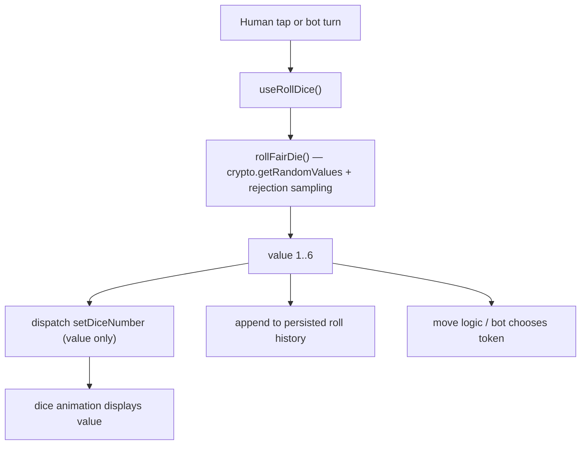
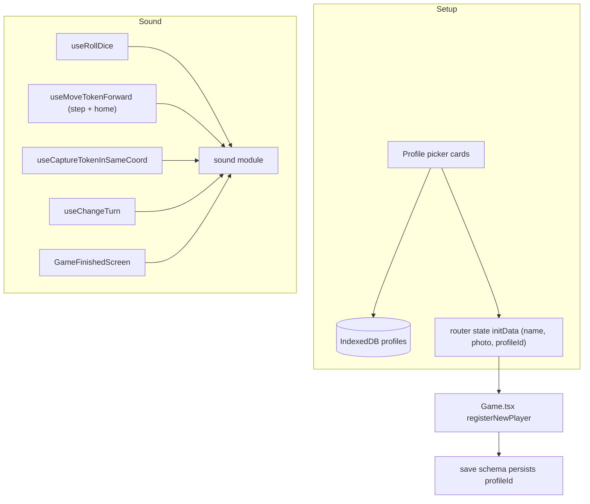

# Offline Fair-Dice Ludo for iPad - Plan

## Goal Capsule

- **Objective:** A family can play honest, fully offline Ludo on one iPad — 2 to 4 local players with optional computer opponents, dice that are genuinely uniform and unbiased, on-device saved profiles (name + photo) selected with a tap, and polished movement, capture, and sound — installed as a home-screen app with no accounts, servers, ads, or online play.
- **Means:** Reuse the open-source LibreLudo project (vendored into a private repo), replace its balanced dice-bag with a Web Crypto uniform random generator, and add on-device profiles, sound, capture polish, and a roll-history screen; ship as an installable PWA. (KTD1, KTD2)
- **Authority hierarchy:** User's stated requirements > the `ludo game research.md` findings > LibreLudo's existing defaults. Where LibreLudo's behavior conflicts with a requirement (dice fairness above all), the requirement wins.
- **Execution profile:** Full-featured in one pass (user-chosen). Build the complete feature set before first real use, rather than a playable MVP then polish.
- **Stop conditions:** Dice pass the uniform-distribution and serial-independence audit; all Requirements met; the game runs in Airplane Mode after install; the app installs to the iPad home screen and resumes a saved game with profiles intact.
- **Tail ownership:** This plan hands off to `ce-work` (or the owner directly) for implementation. GitHub repo creation and `gh auth login` are one-time setup steps in the Appendix.

---

## Product Contract

**Product Contract preservation:** Bootstrapped by `ce-plan` from `ludo game research.md` and four scoping answers. No prior formal contract existed.

### Summary

Build a private, offline, single-iPad Ludo game for family use. Start from LibreLudo — an actively maintained, AGPLv3, offline-first React PWA that already provides ~70% of the feature set (2–4 local players, per-seat bots, offline caching, autosave, tablet layout, token movement, and capture animation). The one thing LibreLudo gets wrong is the single most important requirement: its dice is a "balanced 36-roll bag," not independent random rolls. Replace the dice with a Web Crypto uniform generator, then add sound, on-device selectable profiles with photos, a capture effect, a roll-history/fairness screen, and a landscape-first iPad layout.

### Problem Frame

Popular Ludo apps (Ludo King, Ludo Club, Ludo Supreme) are suspected of biased or adaptive dice to drive engagement; the prior research could not clear all of them. The owner wants the opposite: a game where "whatever comes, comes" — provably honest dice — played privately at home among named family members, with no online opponents, ads, or data leaving the device. The remedy is not a new Ludo engine; correct Ludo rules are fiddly and already solved by LibreLudo. The work is a surgical dice replacement plus presentation and profile features on top of a proven base.

### Requirements

**Fair dice (the core requirement)**
- R1. Every die roll is independently uniform: each face 1–6 has probability 1/6, with no dependence on previous rolls.
- R2. Humans and computer players obtain their roll from exactly one shared dice function.
- R3. The dice function receives no player, board, capture, score, turn, or bot information — it cannot be conditioned on game state.
- R4. The dice animation only displays an already-generated result; it never selects or alters the value.
- R5. A roll-history / fairness screen shows recorded rolls and their running per-face counts, so fairness is inspectable; counts accumulate across sessions.

**Local multiplayer**
- R6. Support 2, 3, or 4 players in a single pass-and-play session on one device.
- R7. Any empty or chosen seat can be a computer player (bot).
- R8. Humans and bots can be mixed freely (e.g., 3 humans + 1 bot).

**Player profiles**
- R9. The owner can create, edit, and delete profiles with a name and a photo, on the device.
- R10. Profiles are stored privately on the iPad (IndexedDB), never uploaded and never bundled into hosted assets.
- R11. At game setup, each seat is filled by tapping a stored profile card; the name and photo appear automatically. A seat's photo and name survive a game resume.
- R12. Photos and profile data never leave the device.

**Presentation**
- R13. Tokens animate step-by-step along their path (retain LibreLudo's existing movement).
- R14. Captures have an enhanced effect: the captured token animates home, plus an impact flash and scale bounce, a capture sound, and haptic feedback where the device supports it.
- R15. A sound pack plays for six events: dice roll, token move, capture, reaching home, turn change, and victory.
- R16. Sound has a visible mute/volume control; the setting persists.
- R17. The board and controls are laid out landscape-first for iPad; portrait remains usable.
- R18. The 3-player layout does not overlap player name labels, including when labels carry a profile photo.

**Platform and privacy**
- R19. The game runs fully offline after the first install (Airplane Mode works), including all sounds.
- R20. The game installs to the iPad home screen via Safari "Add to Home Screen" and launches standalone.
- R21. No accounts, no servers, no ads, no online opponents, no trackers.
- R22. A game in progress autosaves and can be resumed.
- R23. The owner can export and import a backup of profiles (names + photos) as a file, to protect against on-device data loss.

**Licensing**
- R24. Preserve LibreLudo's AGPLv3 LICENSE and author attribution in the source and in the built app.

### Key Decisions

- **Reuse LibreLudo rather than build from scratch.** Ludo's rules (safe squares, home column, exact-count-to-finish, three-sixes forfeit, extra turns, capture logic) are error-prone; LibreLudo implements them with test coverage. Rebuilding adds large effort for no user-visible gain. (session-settled: user-directed — chosen over clean-room build: user deferred the choice to the planner, who selected reuse.) Governs R6, R7, R8, R13.
- **Installable PWA, not a native app.** Fastest path to an offline home-screen app on iPad with no Xcode or App Store. A native wrapper can be added later. (session-settled: user-directed — chosen over native wrapper / native Swift.) Governs R19, R20.
- **Full-featured in one pass.** Build all polish (sound, capture effect, roll history, profiles, backup) before first real use. (session-settled: user-directed — chosen over playable-MVP-first.)
- **New private repo, LibreLudo copied in.** A fresh private repo owned by the user, with LibreLudo's code vendored in and its AGPL notices preserved — not a GitHub fork carrying an upstream link. (session-settled: user-directed — chosen over GitHub fork.) Governs R24.
- **Profiles created on-device, never bundled.** Photos of family members must not be embedded in any hosted site where they could be downloaded. One-time on-device setup replaces a preloaded bundle. Governs R10, R12.
- **Backup/restore is in v1, not deferred.** Family photos are effectively irreplaceable, and iOS can evict on-device storage. A file export/import is the insurance, so it moves into v1 rather than "later." Governs R23.

### Scope Boundaries

**Outside this product's identity**
- Online / networked multiplayer, matchmaking, accounts, cloud sync.
- Ads, analytics, trackers, or any server component.
- App Store distribution.

**Deferred for later**
- Native wrapper (Capacitor) — only if the PWA proves unreliable for storage, audio, or offline.
- Multi-device / cloud sync of profiles (the v1 backup file is manual, single-device insurance).
- External-keyboard / hardware-shortcut support beyond what LibreLudo already has.

### Sources

- `ludo game research.md` — origin document: candidate comparison, dice diagnosis, fair-dice code sketch, effort estimate, PWA recommendation.
- LibreLudo repository — https://github.com/priyanshurav/libreludo (AGPLv3).
- Web Cryptography API — https://www.w3.org/TR/WebCryptoAPI/ (`crypto.getRandomValues`).
- Apple: Add to Home Screen / Open as Web App on iPad — https://support.apple.com/en-in/guide/ipad/ipad8f1f7a29/ipados

---

## Planning Contract

### Key Technical Decisions

- KTD1. **Vendor LibreLudo into a private repo.** Copy the LibreLudo tree into a new private GitHub repo, keep `LICENSE` and author attribution, and remove the upstream `.git` history. This satisfies "fully yours / private" while honoring AGPL (private use triggers no distribution obligation). (session-settled: user-directed — chosen over GitHub fork.) Cites Key Decision "New private repo". Governs R24.
- KTD2. **Fair dice at the single choke point.** Replace the `Math.random()` bag-index pick in `src/hooks/useRollDice.ts` with a stateless uniform generator using `crypto.getRandomValues` and rejection sampling. Retire the per-player `rollBag` in `src/state/slices/diceSlice.ts` and its re-seed in `src/game/storage/retrieveState.ts`. Because both humans and bots already funnel through `useRollDice`, one change satisfies R2 and R3 together. (session-settled: user-directed — the honest-dice requirement is the user's central ask.) Governs R1, R2, R3, R4.
- KTD3. **Roll-history slice + fairness screen, persisted.** Add a Redux slice (or extend `diceSlice`) that appends `{colour, value, timestamp}` on each finalized roll in `useRollDice.ts`, and a new route/page that renders the log and running per-face counts. History is persisted (localStorage), so per-face counts accumulate across sessions rather than resetting on reload — that accumulation is the fairness evidence R5 exists to provide. Governs R5.
- KTD4. **Sound module with gesture-unlock.** New `src/game/sound/` module using the Web Audio API (or `<audio>` with a preloaded buffer), wired at six points: `useRollDice.ts` (roll), `useMoveTokenForward.ts` (step, and its final-step branch for "reaching home"), `useCaptureTokenInSameCoord.ts` (capture), `useChangeTurn.ts` (turn change), and `GameFinishedScreen.tsx` (win). iOS requires a user gesture to unlock audio — unlock the audio context on the first tap. Mute/volume persists to `localStorage`. Sound assets are precached for offline (see KTD8). Governs R15, R16.
- KTD5. **On-device profiles in IndexedDB.** New `src/game/profiles/` module storing `{id, name, photoBlob}` in IndexedDB (photos as `Blob`, not base64, for size). A profile manager UI (create/edit/delete with a file/camera photo picker) and a profile-picker in `src/pages/PlayerSetup/PlayerSetup.tsx`. Thread the chosen profile through the router-state handoff into Redux at `Game.tsx`, and persist `profileId` into the save schema (`src/game/storage/schema.ts`, with a `SAVE_VERSION` bump) so name and photo survive a resume (R11). Two platform mitigations are required: call `navigator.storage.persist()` best-effort at profile creation to reduce eviction, and add `blob:` to `img-src` in `scripts/generate-csp.mjs` (or render photos as `data:` URIs) — the vendored production CSP is `img-src 'self' data:`, which otherwise blocks the `blob:` object URLs and shows every photo broken in the deployed build while working in dev. Governs R9, R10, R11, R12.
- KTD6. **Capture polish + honest haptics.** Extend `src/hooks/useCaptureTokenInSameCoord.ts` and `Token` styling for an impact flash and scale bounce alongside the existing backward-home animation; play the capture sound. Haptics via `navigator.vibrate` is a graceful no-op on iOS Safari and installed iPad PWAs (unsupported) — implement it as best-effort so it works on Android/other devices and never breaks iPad. Governs R14.
- KTD7. **3-player-aware layout.** Thread a `--player-count` CSS variable from `Game.tsx`/`Board.tsx` into the per-colour rules in `src/pages/Play/components/Dice/Dice.module.css`, and add conditional name-width/position rules for the 3-player case; confirm landscape-first sizing in `Board.module.css`. Because profile photos add width to the same labels, the layout must be sized for a photo + name, and the layout gate re-runs after the photo work lands (U6). Governs R17, R18.
- KTD8. **Keep the PWA; verify offline.** Retain `pwa.config.ts` (Workbox precache, `navigateFallback`). Add the chosen audio extensions (e.g. `mp3,wav`) to Workbox `globPatterns` so sounds are precached and play in Airplane Mode; the current list has no audio extension. Verify offline after install. Note: installed iOS PWAs have no auto-update push — a fix reaches the device only when it is next opened online; record this in operational notes. Governs R19, R20, R22.

### High-Level Technical Design

LibreLudo is React 19 + React Router 8 + Redux Toolkit + Vite 7, with `framer-motion` for animation, `vite-plugin-pwa` for offline, CSS Modules for styling, and Vitest for tests. State lives in Redux slices under `src/state/slices/`; pure game logic lives under `src/game/`; animation is driven by hooks under `src/hooks/` against a `tokenMotionRegistry`. Persistence is `localStorage` (lz-string compressed, zod-validated).

The dice flow is the load-bearing change:



Profiles and sound are additive subsystems that hook into existing choke points:



### Assumptions

- The owner uses one iPad running a current Safari/iPadOS; landscape is the primary orientation.
- Family photos are supplied on-device at setup; no photo is pre-bundled.
- Node 24 + pnpm are installed (done during planning). The build matches LibreLudo's CI (Node 24, pnpm).
- Hosting for the one-time install is a simple static HTTPS host. The vendored repo targets Cloudflare Pages and ships a CSP via `_headers`; if a different host (e.g. GitHub Pages) is used, confirm it applies the same CSP mechanism, since the `blob:`/photo behavior depends on it.

### Sequencing

U0 (bootstrap + early storage/offline spike) first — the spike validates the riskiest platform assumption (iPad PWA photo storage) before the profile system is built on top of it. U1 (fair dice) is the top priority and independent. U2 (history) depends on U1's roll-finalization point. Among the presentation units: U3 (sound) precedes U7 (capture), because U7 plays the capture sound through U3's module; U8 (layout) is independent. U4→U5→U6→U12 (profiles, then backup) are sequential. U9 (branding) and U10 (offline verify) come last; U10 also re-runs the iPad layout gate after U6.

---

## Implementation Units

### Unit Index

| U-ID | Title | Key files | Depends on |
|---|---|---|---|
| U0 | Repo bootstrap, green baseline, storage/offline spike | whole tree, `LICENSE`, `pwa.config.ts` | — |
| U1 | Web Crypto fair dice | `src/game/dice/rollFairDie.ts`, `src/hooks/useRollDice.ts`, `src/state/slices/diceSlice.ts` | U0 |
| U2 | Persisted roll history + fairness screen | `src/state/slices/rollHistorySlice.ts`, `src/pages/RollHistory/*`, `src/routes.ts` | U1 |
| U3 | Sound system | `src/game/sound/*`, `public/sounds/*`, movement/capture/turn/win hooks | U0 |
| U4 | IndexedDB profile storage + CSP fix | `src/game/profiles/store.ts`, `scripts/generate-csp.mjs` | U0 |
| U5 | Profile management UI | `src/pages/Profiles/*`, `src/routes.ts` | U4 |
| U6 | Profile picker in setup | `src/pages/PlayerSetup/*`, `src/pages/Play/components/Game/Game.tsx`, `src/game/storage/schema.ts` | U5 |
| U7 | Enhanced capture effect | `src/hooks/useCaptureTokenInSameCoord.ts`, `Token.module.css` | U3 |
| U8 | 3-player and landscape layout | `Dice.module.css`, `Board.module.css`, `Game.tsx`/`Board.tsx` | U0 |
| U9 | Branding and attribution | home/footer, manifest, `pwa.config.ts` | U0 |
| U10 | Offline install + PWA verification | `pwa.config.ts`, manifest | U1–U9, U12 |
| U11 | Dice fairness audit (uniformity + independence) | `tests/game/diceFairness.test.ts` | U1 |
| U12 | Profile backup / restore | `src/game/profiles/backup.ts`, `src/pages/Profiles/*` | U4, U6 |

### U0. Repository bootstrap, green baseline, and storage/offline spike
- **Goal:** LibreLudo running in a new private repo with green tests, plus a proven answer to the riskiest platform assumption before any feature work.
- **Requirements:** R13 (baseline verifies existing movement animation is unchanged), R24 (preserve license during copy).
- **Files:** whole tree (copy), `LICENSE`, `package.json`, `README.md` (add a short "based on LibreLudo (AGPLv3)" note), `pwa.config.ts`.
- **Approach:** Create the private repo (Appendix A). Copy the LibreLudo tree in, remove upstream `.git`, keep `LICENSE` and the author attribution in `src/root.tsx`. `pnpm install`, `pnpm run dev`, `pnpm test`. Then run a small **storage/offline spike**: build a minimal version, install it to the iPad home screen, and round-trip a photo `Blob` through IndexedDB, then reload and enter Airplane Mode to confirm the Blob and app survive. This validates the KTD5/Appendix D eviction risk cheaply before U4–U6 build the full profile system.
- **Test Scenarios:** `pnpm test` passes unchanged; `pnpm run dev` serves the home page; `pnpm run build` succeeds; the spike confirms a photo Blob persists across an installed-PWA reload in Airplane Mode (or surfaces the failure early).
- **Verification:** Baseline commit pushed; spike result recorded (persists / needs mitigation).

### U1. Web Crypto fair dice
- **Goal:** Replace the balanced bag with independent uniform rolls at the shared choke point.
- **Requirements:** R1, R2, R3, R4.
- **Files:** new `src/game/dice/rollFairDie.ts`; `src/hooks/useRollDice.ts` (call the new function instead of `Math.random()` bag index); `src/state/slices/diceSlice.ts` (retire `rollBag`, `generateRollBag`, reshape `setDiceNumber` to take a value directly); `src/game/storage/retrieveState.ts` (remove the `rollBag` re-seed at load); `tests/slices/dice.test.ts` (replace bag-distribution assertions).
- **Approach:** Implement `rollFairDie()` with `crypto.getRandomValues(Uint32Array(1))` and rejection sampling against the largest multiple of 6 below 2^32, returning `(v % 6) + 1` (see Appendix C). `useRollDice` calls it, then dispatches the value; keep the existing placeholder-delay reveal so the animation still shows the result (R4). Confirm no board/player/state is passed into `rollFairDie` (R3). Confirm bot chained rolls in `useExecuteBotMove.ts` still route through `useRollDice` (R2).
- **Test Scenarios:** `rollFairDie` returns only integers 1–6 over a large sample; `rollFairDie` takes zero arguments (R3); the reducer stores the exact value produced; humans and bots invoke the same function (single call site); resuming a saved game does not attempt to rebuild a bag.
- **Verification:** `pnpm test`, `pnpm run type-check`. Full fairness audit is U11.

### U2. Persisted roll history and fairness screen
- **Goal:** Record every roll, persist the log, and expose a fairness view.
- **Requirements:** R5.
- **Files:** new `src/state/slices/rollHistorySlice.ts` (append `{colour, value, timestamp}`); `src/hooks/useRollDice.ts` (append on finalize); `src/game/storage/*` (persist history alongside the save so counts survive reload); new `src/pages/RollHistory/RollHistory.tsx` + `.module.css`; `src/routes.ts` (add route).
- **Approach:** Append to the history on the same finalize step that sets the dice value, and persist it (localStorage) so per-face counts accumulate across sessions. The page shows total rolls, per-face counts and percentages, and a scrollable recent-rolls list. Reach it from a pause/menu control, not a control competing with the board during play.
- **Test Scenarios:** each roll appends exactly one entry with the correct value; per-face counts sum to total rolls; counts persist across a reload; the route renders with empty and populated history.
- **Verification:** `pnpm test`; manual view after several rolls and a reload.

### U3. Sound system
- **Goal:** A six-event sound pack with a persisted mute/volume control, working offline.
- **Requirements:** R15, R16, R19.
- **Files:** new `src/game/sound/` (loader + `playSound(name)` + mute state); sound assets in `public/sounds/`; wire into `src/hooks/useRollDice.ts` (roll), `src/hooks/useMoveTokenForward.ts` (step + final-step "reaching home"), `src/hooks/useCaptureTokenInSameCoord.ts` (capture), `src/hooks/useChangeTurn.ts` (turn change), `src/pages/Play/components/GameFinishedScreen/GameFinishedScreen.tsx` (win); a mute/volume control near the play screen header; `pwa.config.ts` (add audio extensions to `globPatterns`); persist mute to `localStorage`.
- **Approach:** Preload short audio buffers. Unlock the audio context on the first user gesture (iOS autoplay policy). Wire all six events; "reaching home" fires in the final-step branch of the move animation. Respect mute globally. The mute control has clear on/muted visual states.
- **Test Scenarios:** `playSound` is a no-op when muted; mute persists across reload; each of the six wired events triggers its sound (mockable call assertion); audio files appear in the precache manifest so they load in Airplane Mode.
- **Verification:** `pnpm test`; manual audio check on iPad Safari including first-tap unlock and Airplane Mode.

### U4. IndexedDB profile storage + CSP fix
- **Goal:** On-device CRUD for profiles with photos that actually render in production.
- **Requirements:** R9, R10, R12.
- **Files:** new `src/game/profiles/store.ts` (IndexedDB open/upgrade, `createProfile`, `listProfiles`, `updateProfile`, `deleteProfile`; photos as `Blob`); `src/types/profiles.ts`; `scripts/generate-csp.mjs` (add `blob:` to `img-src`); `package.json` (add `fake-indexeddb` devDependency for tests).
- **Approach:** Use a small IndexedDB wrapper (native or `idb`). Store `{id, name, photoBlob, createdAt}`. Add `blob:` to the production CSP `img-src` (or use `data:` URIs) so object-URL photos load on the deployed build, not just in dev. Call `navigator.storage.persist()` best-effort at first write to reduce eviction. Surface a user-facing error (not a silent failure) when a write fails, e.g. quota exceeded. Produce object URLs for display and revoke them on unmount.
- **Test Scenarios:** create→list returns the profile; update changes name/photo; delete removes it; a large photo Blob round-trips; data persists across reload (via `fake-indexeddb`); a simulated failed write surfaces an error rather than losing data silently.
- **Verification:** `pnpm test`; manual persistence check on the installed iPad PWA; confirm photos render on the built/deployed app (CSP), not only in dev.

### U5. Profile management UI
- **Goal:** Screen to add/edit/delete family profiles with a photo, with real error and empty states.
- **Requirements:** R9, R12.
- **Files:** new `src/pages/Profiles/Profiles.tsx` + `.module.css`; `src/routes.ts` (route); photo input via `<input type="file" accept="image/*" capture>`.
- **Approach:** List existing profiles as cards; add/edit form with name + photo; delete with confirm. Downscale/compress the photo on selection (canvas) before storing. Handle the empty state (no profiles yet → prominent "add profile" affordance) and the failure/cancel paths (picker cancelled, unsupported format, downscale failure, write failure) with a visible message. Tap targets are at least ~44pt.
- **Test Scenarios:** adding a profile shows it in the list; editing updates the card; deleting removes it; an oversized image stores a downscaled Blob; cancelling the picker leaves the form usable; a write failure shows an error.
- **Verification:** `pnpm test`; manual on iPad including camera capture.

### U6. Profile picker in setup
- **Goal:** Fill each seat by tapping a stored profile, with a clear first-run path.
- **Requirements:** R11, R6, R7, R8.
- **Files:** `src/pages/PlayerSetup/PlayerSetup.tsx` (per-seat profile selection; keep the 2/3/4 selector and bot toggle); `src/pages/PlayerSetup/components/PlayerInput/PlayerInput.tsx`; `src/types/players.ts` (add `photo`/`profileId` to `TPlayerInitData`); `src/pages/Play/components/Game/Game.tsx` (carry photo/name/profileId into `registerNewPlayer`); `src/game/storage/schema.ts` (add `profileId` to `playerSchema`, bump `SAVE_VERSION`, handle old saves gracefully via the existing error boundary); token/name rendering to show the photo where the player label appears.
- **Approach:** Each seat shows the selected profile's name + photo, or a "choose profile" card that opens a modal picker sourced from U4. Re-tapping a seat changes it. A profile already assigned to another seat shows as taken (cannot be double-selected). If no profiles exist, the picker offers an inline "+ Create profile" affordance routing to U5. Persist `profileId` into the save so a resume shows the same photo/name; if the referenced profile is gone (deleted or evicted), fall back to a placeholder avatar and the saved name. Bot seats keep the bot toggle and use a default avatar.
- **Test Scenarios:** selecting a profile fills that seat's name/photo; a profile taken by one seat is not selectable for another; the empty-profiles picker routes to creation; 2/3/4-player and mixed human+bot setups start; a resumed game shows the correct photos; a resumed game whose profile was deleted shows the fallback avatar; validation still blocks empty/all-bot setups.
- **Verification:** `pnpm test`; manual setup-to-play and resume on iPad.

### U7. Enhanced capture effect
- **Goal:** Make captures feel impactful.
- **Requirements:** R14.
- **Files:** `src/hooks/useCaptureTokenInSameCoord.ts` (add flash/scale-bounce alongside the backward-home animation; trigger capture sound via U3); `src/pages/Play/components/Token/Token.module.css` / `Token.tsx`; best-effort `navigator.vibrate` guarded for unsupported platforms.
- **Approach:** On capture, flash the captured token and add a short scale bounce via framer-motion before/at the start of the existing reverse-path animation; play the capture sound (U3 must exist first). Haptics is best-effort and a no-op on iPad (KTD6).
- **Test Scenarios:** a single capture plays the effect and returns the token to base; simultaneous multi-captures still stagger and complete; `navigator.vibrate` absence does not throw; capture animation remains smooth on iPad hardware.
- **Verification:** `pnpm test`; manual capture on iPad.

### U8. 3-player and landscape layout
- **Goal:** No label overlap in 3-player (including labels with photos); landscape-first on iPad.
- **Requirements:** R17, R18.
- **Files:** `src/pages/Play/components/Dice/Dice.module.css`; `src/pages/Play/components/Board/Board.module.css`; `src/pages/Play/components/Game/Game.tsx` / `Board.tsx` (thread `--player-count`).
- **Approach:** Add a `--player-count` CSS variable and 3-player-specific name-width/position rules, sized for a photo + name label. Confirm the board and controls sit well in landscape at iPad sizes; keep portrait usable. Because U6 adds photos to labels, the layout gate re-runs after U6 (see U10 / Verification Contract).
- **Test Scenarios:** 3-player labels (with photo + name) do not overlap at iPad portrait and landscape widths; 2 and 4-player layouts unaffected.
- **Verification:** Manual visual check at iPad landscape (1366×1024) and portrait (1024×1366), repeated after U6 lands.

### U9. Branding and attribution
- **Goal:** Make it feel like the family's game while honoring the license.
- **Requirements:** R24, R21.
- **Files:** home page / footer content; app name, icons, theme colour in `pwa.config.ts` and manifest; keep `LICENSE` and the AGPL attribution intact.
- **Approach:** Optionally replace LibreLudo-specific branding/links with a family title and icons. Preserve the AGPL LICENSE and author attribution (required). `THIRD_PARTY_LICENSES.txt` is produced by the existing `rollup-plugin-license` build step (already in `vite.config.ts`) — keep that step; do not hand-author the file. Confirm no analytics/ads exist (R21).
- **Test Scenarios:** built app still ships `LICENSE` and the build-generated `THIRD_PARTY_LICENSES.txt`; attribution present; no third-party network calls at runtime.
- **Verification:** `pnpm run build`; inspect built output; offline network check.

### U10. Offline install and PWA verification
- **Goal:** Prove it installs and runs offline on the iPad, and re-check layout after photos.
- **Requirements:** R19, R20, R22.
- **Files:** `pwa.config.ts` (audio precache from KTD8); manifest/icons.
- **Approach:** Build and deploy once to an HTTPS host. On the iPad in Safari: Share → Add to Home Screen → open standalone. Create profiles. Turn on Airplane Mode and confirm a full game plays with sound, and resumes with profiles intact. Re-run the 3-player layout gate now that photo labels exist (U6/U8).
- **Test Scenarios:** app loads offline after install; sounds play offline; a saved game resumes offline with correct photos; 3-player photo labels do not overlap.
- **Verification:** Manual on iPad in Airplane Mode.

### U11. Dice fairness audit (uniformity + independence)
- **Goal:** Prove the new dice is uniform and shows no serial dependence.
- **Requirements:** R1, R2, R3.
- **Files:** new `tests/game/diceFairness.test.ts`.
- **Approach:** Draw a large sample (≥60,000) from `rollFairDie()`. Assert uniformity: chi-square goodness-of-fit against a pinned significance level (fail if p < 0.001), which each face's count must satisfy. Assert independence: a runs test or lag-1 serial-correlation check within tolerance, so a stateful RNG defect (e.g., a polyfill reusing state) is caught rather than passing a marginal-frequency-only test. Assert `rollFairDie` has arity 0. Add a note that this proves this build's dice, not any commercial app's.
- **Test Scenarios:** face counts pass the chi-square bound at the pinned level; the serial-correlation/runs check passes; no face missing; arity is 0.
- **Verification:** `pnpm test`.

### U12. Profile backup and restore
- **Goal:** Let the owner export and re-import profiles so photos survive data loss or a device change.
- **Requirements:** R23.
- **Files:** new `src/game/profiles/backup.ts` (serialize profiles + photos to a downloadable file; parse + validate on import); `src/pages/Profiles/Profiles.tsx` (export/import buttons).
- **Approach:** Export all profiles (names + photos) to a single file the owner saves off-device (e.g., Files app). Import validates and merges/replaces profiles. Photos are encoded in the file (base64 or a zip); nothing is uploaded. This is the insurance against the iOS eviction risk named in Appendix D.
- **Test Scenarios:** export produces a file containing all profiles and photos; import restores them into an empty store; import validates a malformed file without corrupting existing data.
- **Verification:** `pnpm test`; manual export/import round-trip on iPad.

---

## Verification Contract

| Check | Command | Applies to |
|---|---|---|
| Type check | `pnpm run type-check` | all units |
| Unit tests | `pnpm test` | U0, U1, U2, U3, U4, U5, U6, U7, U11, U12 |
| Production build | `pnpm run build` | U0, U9, U10 |
| Local preview | `pnpm run preview` | U10 |
| Dev server | `pnpm run dev` | manual checks |

- **Fair-dice gate:** U11 must pass — uniformity (chi-square, fail if p < 0.001) AND the serial-independence check over ≥60,000 samples — before Definition of Done.
- **Offline gate:** U10 manual check in Airplane Mode on the iPad: full game plays with sound, saved game resumes with profiles, photos render on the deployed build (CSP).
- **iPad layout gate:** visual check at landscape (1366×1024) and portrait (1024×1366); no 3-player label overlap — run once at U8 and again after U6 adds photo labels.
- **Storage-durability gate:** the U0 spike result is recorded; if it showed eviction, the U4 mitigations (`navigator.storage.persist()`) and U12 backup are the required response.
- **Privacy gate:** no third-party network calls at runtime; no photo or profile data leaves the device.

---

## Definition of Done

**Global**
- All Requirements R1–R24 met.
- Dice fairness audit (U11) green for both uniformity and serial-independence; humans and bots share one dice function that receives no game state. (U11 proves this build's dice; independence is tested, not merely assumed.)
- App installs to the iPad home screen and plays a full 2/3/4-player game offline, including a bot seat, with sound.
- Profiles created/edited on-device, selectable by card, with photos that never leave the device, that render on the deployed build, and that survive a game resume (with a fallback avatar if a profile was removed).
- Profile backup export/import works (U12).
- Sound plays for all six events with a persisted mute; capture effect present (haptics best-effort, no-op on iPad).
- 3-player photo labels do not overlap (layout gate re-run after U6).
- AGPL LICENSE and attribution preserved in source and build.
- Abandoned experimental code removed; no dead code left in the diff.

**Per-unit:** each unit's Test Scenarios pass and its Verification check is green.

---

## Documentation / Operational Notes

- **No auto-update on installed iOS PWAs.** A deployed fix reaches the iPad only when the app is next opened online; if the family plays mostly offline, tell them to open it online occasionally to pick up updates.
- **Save-version bump.** Adding `profileId` to the save schema bumps `SAVE_VERSION`; an in-progress game saved before the change fails validation on resume and is handled by the existing error boundary (the owner loses that one in-progress game, not their profiles).

---

## Appendix

### A. GitHub setup (one-time)

The owner is already signed in to GitHub in Chrome. Remaining steps:

1. Create the private repo (via the website, logged-in Chrome): New repository → name it (e.g., `family-ludo`) → **Private** → create empty (no README needed).
2. Link the Mac for pushing — run once:
   ```bash
   gh auth login
   ```
   Choose GitHub.com → HTTPS → "Login with a web browser"; approve in the open Chrome session.
3. From the project folder, initialize and push (part of U0):
   ```bash
   git init && git add -A && git commit -m "chore: vendor LibreLudo baseline (AGPLv3)"
   git branch -M main
   git remote add origin https://github.com/<your-username>/family-ludo.git
   git push -u origin main
   ```

### B. Effort estimate (from research, adjusted for review additions)

| Time | Result |
|---|---|
| ~1–2 hours | Fair dice implemented and tested; basic sound |
| 3–6 hours | Profiles + photos + cards; capture effect; sound controls |
| 6–12 hours | iPad polish, offline verification, fairness audit (uniformity + independence), backup/restore, deploy |
| 1–2 days | Finished family game with robust edge cases |

The 30-minute assumption is not realistic for the full-featured build the owner chose. The Ludo rules are already solved; the remaining work is integration and polish.

### C. Fair-dice reference implementation

Directional sketch for `src/game/dice/rollFairDie.ts` — the implementer adapts it:

```ts
export function rollFairDie(): number {
  const values = new Uint32Array(1);
  const limit = 4_294_967_292; // largest multiple of 6 below 2^32
  do {
    crypto.getRandomValues(values);
  } while (values[0] >= limit);
  return (values[0] % 6) + 1;
}
```

Rejection sampling removes the small modulo bias. `getRandomValues` is specified as cryptographically strong. This is still pseudorandom, as almost all software dice are, but it is honest, independent, and unpredictable — and takes no game state, satisfying R3.

### D. Honest caveats (corrections to the research)

- **Haptics on iPad:** the Vibration API (`navigator.vibrate`) is not supported in Safari or installed iPad PWAs. The research listed haptics as a plain feature; here it is best-effort and a no-op on iPad.
- **iOS audio:** browsers block audio until a user gesture; the sound module must unlock on the first tap or sound will be silent on iPad.
- **On-device storage durability:** IndexedDB/localStorage on iOS can be evicted under storage pressure. This plan responds with three layers: the U0 spike (validate early), `navigator.storage.persist()` in U4 (reduce eviction), and the U12 backup/restore (recover if it happens).
- **Production CSP vs dev:** the vendored build ships `img-src 'self' data:`, which blocks `blob:` object-URL photos on the deployed app while dev works fine; U4 adds `blob:` (or uses `data:` URIs) so photos are not silently broken in production.
