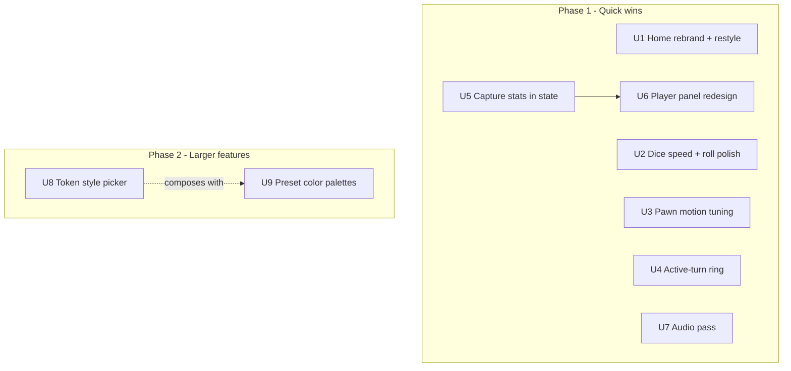

# Family Ludo Feel & Feature Improvements - Plan

## Goal Capsule

- **Objective:** Family Ludo looks and feels like its own polished product — a warm branded front door, snappy dice and pawn motion, a clear "your turn" cue, richer player panels with kill stats, custom token styles, preset color palettes, and a fuller sound pass.
- **Means:** Eight focused changes on the existing React 19 + Redux Toolkit + framer-motion codebase, delivered in two phases (quick wins first, larger features second). No backend added; the app stays offline and on-device.
- **Authority hierarchy:** Requirements (R-IDs) win on product behavior; Key Technical Decisions (KTDs) win on mechanism; units override neither.
- **Stop conditions:** Cross-device player sync is explicitly out of scope (user will keep local save per device). Ads, paywalls, and "unlock by watching ad" gates from the reference screenshots are out of scope — every token style ships free.
- **Execution profile:** Incremental. Each unit is independently shippable and verifiable in the browser preview.

---

## Product Contract

### Summary

The game plays well but still wears the upstream open-source project's identity and some rough edges. This plan rebrands the landing page to "Family Ludo", speeds up dice and pawn motion, makes the active turn obvious, upgrades the player panels with photos and kill counters, adds a token-style picker and preset color palettes, and broadens the sound design. Cross-device sync of saved players and auto-roll are dropped by user decision.

### Problem Frame

The app was forked from an upstream Ludo project ("LibreLudo", authored by others). The landing page still shows that name, that author's credit, and generic feature blurbs (Instant Play, Zero Ads, 100% Private, Open Source) — it does not read as the family's own game. In play, the dice spins for a full second before revealing a result (feels "very very slow"), the "whose turn" cue is a subtle bounce that is easy to miss, the corner panels just say "Human", and captures are never counted. Tokens are one fixed shape in four fixed colors, with no way to pick a style or a color scheme, and no way to let the dice roll itself when a player is slow.

### Key Decisions

- Drop cross-device sync (item 2). Governs scope only — no requirement added. The app stays offline/on-device; the existing manual profile export/import in `src/game/profiles/backup.ts` remains the only cross-device path.
- No ads or paywalls. The reference screenshots show ad-gated token packs; we ship all token styles free. Governs R14.
- Custom colors keep the internal four-slot identity (blue/red/green/yellow as structural keys) and only change what is *displayed*. Governs R17, R18.

### Requirements

Landing page & branding
- R1. The landing page shows the name "Family Ludo" and removes the "LibreLudo" name.
- R2. The landing page removes the upstream author credit and the "Instant Play", "Zero Ads", "100% Private", and "Open Source" feature blocks.
- R3. The landing page uses the game's warm/creamish visual style rather than the current off-white slate look.
- R4. The landing page shows friendly welcoming copy and colorful Ludo motifs (dice, pawns, the four Ludo colors).
- R5. The app name is "Family Ludo" in page metadata (title, share/social tags, PWA/app title).

Dice & pawn motion
- R6. The dice reveals its result quickly — the pre-result spin is much shorter than the current 1 second.
- R7. The dice roll has an improved roll animation and an improved roll sound.
- R8. Pawn movement animation is smoother and/or snappier than the current forward step.

Turn indicator
- R9. The active player's tokens show a prominent, animated highlight (e.g. a rotating ring around the token) that is clearly more visible than the current up/down bounce.

Player panels & stats
- R10. Each player panel shows the player's name (not the literal "Human").
- R11. Each player panel shows the player's photo when one is set.
- R12. Each player panel shows a kills counter (opponent pawns this player captured).
- R13. Each player panel shows a killed-by-others counter (this player's pawns captured by others).

Token style picker
- R14. A token-style picker lets the user choose the pawn/token style, reachable from the home/setup flow, with **2–3 free styles** to start (classic pawn plus 1–2 alternatives inspired by the reference screenshots); more styles may be added later.
- R15. The chosen token style applies to all four players in the game and persists across sessions on that device.

Custom colors
- R16. The home/setup flow lets the user choose the four player colors from a **set of curated preset palettes** (4–6 ready-made 4-color schemes), each vetted so the colors stay distinguishable and readable against the board.
- R17. When a preset palette is chosen, the tokens, dice buttons, and player panels display those colors.
- R18. When a preset palette is chosen, the board quadrants and colored paths display those colors to match.

Audio
- R19. Distinct sounds play for: dice roll (improved), pawn move, turn switch, capture (kill), and a pawn reaching home/finishing.

### Scope Boundaries

Deferred / out of scope
- Auto-roll (dice rolls itself for an idle player) — dropped for now by user decision. For co-located family play it risks grabbing a turn from someone who is just chatting; revisit if the family wants it.
- Cross-device sync of saved players (item 2) — user keeps local save per device.
- Ads, ad-gated unlocks, and any paywall.
- Online multiplayer or accounts.
- Free-form/arbitrary color picker — superseded by curated preset palettes (R16).

### Resolved Decisions (from review)

- Custom colors use **curated preset palettes**, not a free color picker (R16) — avoids clashing/indistinguishable choices and board-contrast problems.
- **Auto-roll is dropped** for now (see Scope Boundaries).
- Token picker ships **2–3 styles** to start (R14).

### Sources

- Codebase map (see Planning Contract KTDs for exact files).
- Reference screenshots supplied by user: token picker grids, active-turn ghost token, and a four-corner player-panel layout with ⚔️ kills / 💀 killed counters.

---

## Planning Contract

### Key Technical Decisions

- KTD1. **Rebrand in place, restyle the landing page to match the game.** Edit `src/pages/HomePage/HomePage.tsx` (name at line ~43, feature blocks lines ~64–84, author/copyright lines ~101–106) and `HomePage.module.css`. Reuse the game's warm palette; the in-game "creamish" look is the image `src/assets/bg.jpg` applied in `src/pages/Play/components/Game/Game.tsx`, so either reuse that image or introduce a matching cream background color/token. Update branding strings in `src/root.tsx` (JSON-LD name, `og:site_name`, apple title, author) and the console banner in `src/entry.client.tsx`. Governs R1–R5.
  - The storage-key prefix `libreludo-` (localStorage keys, IndexedDB DB name `libreludo-profiles`) is functional, not user-visible. Do NOT rename it in this plan — renaming keys would orphan users' existing saved games and profiles. Left as-is deliberately.
- KTD2. **Cut the dice pre-result delay and keep it configurable.** `DICE_PLACEHOLDER_DELAY = 1000` in `src/hooks/useRollDice.ts` (line 13) is the "very slow" cause. Reduce substantially (target ~250–400ms; final value tuned in preview). Improve the roll visual in `src/pages/Play/components/Dice/Dice.tsx` (placeholder GIF → face SVG swap). Governs R6, R7.
- KTD3. **Tune pawn motion via existing transition constants.** `transitionStates` in `src/game/tokens/constants.ts` (`forward: 500ms easeInOut`, `backward: 100ms linear`) drives framer-motion in `Token.tsx`. Adjust forward duration/easing for snappier movement; also revisit the bot `sleep(500)` in `src/hooks/useExecuteBotMove.ts` if pacing feels slow. Governs R8.
- KTD4. **Replace the bounce highlight with an animated ring.** The active cue is `@keyframes bounce` in `src/pages/Play/components/Token/Token.module.css`, toggled by `isActive` in `Token.tsx`. Replace/augment with a rotating or pulsing ring element around the active token. Keep the existing `isActive` gate (`activateTokens` reducer in `playersSlice.ts`) as the trigger. Governs R9.
- KTD5. **Add per-player capture stats to game state.** `TPlayer` in `src/state/slices/playersSlice.ts` currently has no stats. Add `kills` and `deaths` (killed-by-others) counters. Increment at the existing capture sites: `src/hooks/useCaptureTokenInSameCoord.ts` and `src/hooks/useMoveAndCaptureToken.ts` — capturing player's `kills`++ and captured player's `deaths`++. Add the counters to the save schema (`src/game/storage/schema.ts`) as **optional-with-default (`z.number().default(0)`)**, not required: the loader does one strict `safeParse` with no migration branch, so a required field would discard every existing save; optional-with-default lets old saves load and backfill 0. Bump `SAVE_VERSION` for record-keeping only. Governs R12, R13.
- KTD6. **Redesign player panels in `Dice.tsx`.** The corner panels live in `src/pages/Play/components/Dice/Dice.tsx` (+ `Dice.module.css`), already rendering `ProfilePhoto` + name. Extend to show the kill/death counters (KTD5) laid out like the reference (⚔️ kills, 💀 killed). Name already comes from the player, not the literal "Human"; ensure the setup default label isn't leaking "Human" into play. Governs R10–R13.
- KTD7. **Token style as a new dimension alongside color.** Today all tokens are one SVG `src/assets/token.svg` recolored via `--fill-colour` in `src/pages/Play/components/Token/Token.tsx`. Introduce a set of token-style SVGs and a `tokenStyle` selection (persisted in localStorage like sound settings). Render the chosen style in `Token.tsx`; each style must still accept the per-player color via CSS var so styles compose with custom colors (KTD8). Add a picker UI reachable from home/setup. Governs R14, R15.
- KTD8. **Custom colors: display-only recolor, board SVG tokenized.** Player colors are hardcoded in `src/game/players/constants.ts` (`playerColours`), and `TPlayerColour` ('blue'|'red'|'green'|'yellow') is a structural identity key used for start coords, home paths, and sequences — this stays as the internal slot identity. Offer **curated preset palettes** (4–6 vetted 4-color sets, the current colors being the default), not a free color picker — this keeps players distinguishable and readable against the board. The chosen palette drives a per-slot *display color* override, persisted **device-wide in localStorage** (like `tokenStyle`/sound settings) — not in the game save — so U9 leaves `schema.ts`/`validator.ts` untouched. Tokens/dice/panels read the override (easy). The board quadrant colors are baked into `src/assets/board.svg` as ~80 `fill:#…` attributes across the four colors, with red appearing as two shades (`#ff0000`, `#ff0002`); to recolor the board, map every fill of each quadrant color to that slot's CSS variable and decide whether the `#ff0000` fills are quadrant or decoration. This SVG tokenization is the larger part of the work. Governs R16–R18. (session-settled: user-directed — custom colors confirmed in scope; user asked "is this possible?" and accepted a medium-large effort over dropping it.)
- KTD9. **Extend the existing sound manager.** `src/game/sound/soundManager.ts` already defines six sounds (`diceRoll, move, capture, home, turn, win`) with files in `public/sounds/*.wav`, triggered from the respective hooks. Replace/improve the `diceRoll` asset and confirm each event fires: move (`useMoveTokenForward.ts`), turn (`useChangeTurn.ts`), capture (`useCaptureTokenInSameCoord.ts`), home (`useMoveAndCaptureToken.ts`), win (`GameFinishedScreen.tsx`). Add any missing trigger and supply improved audio assets. Governs R7 (sound half), R19.

### High-Level Technical Design

Two phases. Phase 1 changes are localized edits to existing components/constants and carry low risk. Phase 2 adds new state dimensions (token style, preset color palettes) and touches the board SVG, so they are sequenced after the quick wins and after the stats/state changes they can build on.

### Assumptions

- Improved audio assets (dice roll + any new sounds) can be sourced as royalty-free `.wav`/`.mp3` and dropped into `public/sounds/`. If not readily available, U7 ships tuned playback of existing assets plus placeholders.
- Token-style SVGs will be created/sourced as simple recolorable shapes (single fill via CSS var), not the exact licensed art in the screenshots (which are references, not assets to copy).

### Sequencing

Phase 1: U1, U2, U3, U4, U7 are independent and can proceed in any order. U5 precedes U6 (panel shows the counters U5 adds). Phase 2: U8 and U9 should be aware of each other (token styles must accept palette colors); build U8 first, then U9 so the board tokenization lands last.

---

## Implementation Units

### U1. Landing page rebrand and restyle
- Goal: Landing page reads as "Family Ludo", warm/creamish, colorful, friendly, with upstream identity removed.
- Requirements: R1, R2, R3, R4, R5.
- Files: `src/pages/HomePage/HomePage.tsx`, `src/pages/HomePage/HomePage.module.css`, `src/root.tsx`, `src/entry.client.tsx`, possibly `src/index.css` (background token), reuse `src/assets/bg.jpg` or a matching cream color.
- Approach: Rename to "Family Ludo"; delete the four feature blocks and the author/copyright/license-credit block; rewrite hero copy to be warm and welcoming; apply the game's cream background and add colorful dice/pawn/Ludo-color motifs. Update metadata strings in `root.tsx` and the console banner in `entry.client.tsx`. Do NOT rename `libreludo-` storage keys (KTD1).
- Test Scenarios: Home page shows "Family Ludo", no "LibreLudo"/author/feature-blurb text; browser tab title and social tags say Family Ludo; background matches the game's warm look.
- Verification: `pnpm lint && pnpm type-check`; visual check in preview.

### U2. Dice speed and roll polish
- Goal: Dice reveals fast with a better roll animation and sound.
- Requirements: R6, R7.
- Files: `src/hooks/useRollDice.ts` (line 13 constant), `src/pages/Play/components/Dice/Dice.tsx`, dice assets in `src/assets/dice/`, `public/sounds/diceRoll.wav`.
- Approach: Lower `DICE_PLACEHOLDER_DELAY` from 1000 to ~250–400ms (tune in preview); keep it a named constant. Improve the placeholder→face transition. Pair with the improved dice sound from U7/KTD10.
- Test Scenarios: Rolling reveals a result in well under a second; roll animation and sound feel snappy; fair-die logic unchanged (result still from `rollFairDie()`).
- Verification: `pnpm test` (dice/fairness tests still pass); preview timing check.

### U3. Pawn motion tuning
- Goal: Pawn movement looks smoother/snappier.
- Requirements: R8.
- Files: `src/game/tokens/constants.ts` (`transitionStates`), `src/pages/Play/components/Token/Token.tsx`, optionally `src/hooks/useExecuteBotMove.ts` (`sleep(500)`).
- Approach: Adjust the `forward` transition duration/easing; verify multi-step hops still read clearly and captures animate correctly via `tokenMotionRegistry`.
- Test Scenarios: A multi-step move animates smoothly without skipping tiles; capture animation still plays.
- Verification: `pnpm test`; preview check.

### U4. Active-turn ring highlight
- Goal: The active player's tokens carry a prominent animated ring instead of the subtle bounce.
- Requirements: R9.
- Files: `src/pages/Play/components/Token/Token.module.css` (replace/augment `@keyframes bounce`), `src/pages/Play/components/Token/Token.tsx`, `src/state/slices/playersSlice.ts` (the `activateTokens` reducer that sets `isActive` — the trigger, per KTD4).
- Approach: Add a rotating/pulsing ring around the active token, gated by the existing `isActive` logic. Use a color-independent ring treatment — a neutral (dark or white) outline plus a soft glow/shadow, not a single tinted color — so it stays clearly visible on all four player colors and on light tiles. This treatment must also hold up under custom colors (U9); re-check ring visibility when U9 lands.
- Test Scenarios: On a player's turn, their movable tokens show the ring; it clears when the turn ends or a token is focused.
- Verification: Preview check across all four colors.

### U5. Capture stats in game state
- Goal: Track per-player kills and killed-by-others, persisted across save/resume.
- Requirements: R12, R13.
- Files: `src/state/slices/playersSlice.ts` (`TPlayer` + reducers), `src/hooks/useCaptureTokenInSameCoord.ts`, `src/hooks/useMoveAndCaptureToken.ts`, `src/game/storage/schema.ts`, `src/game/storage/validator.ts` (bump `SAVE_VERSION`).
- Approach: Add `kills` and `deaths` to `TPlayer` (default 0). On a capture, increment capturer's `kills` and the captured player's `deaths`. Add the fields to the Zod save schema as **optional-with-default** (`z.number().default(0)`), not required — the loader (`retrieveState.ts`) runs one strict `safeParse` and has no version-branching migration step, so a required field would make every existing v2 save fail validation and be discarded. Optional-with-default lets pre-bump saves load and backfill 0. Bump `SAVE_VERSION` for record-keeping only; do not rely on it for migration. Confirm every capture branch reaches a `saveState` after the increment so counts survive an immediate reload.
- Test Scenarios: After a capture, capturer kills +1 and victim deaths +1; counts survive save/reload; a pre-bump save with no `kills`/`deaths` still loads and shows 0 (not discarded).
- Verification: `pnpm test` (storage/schema tests); manual capture in preview.

### U6. Player panel redesign
- Goal: Corner panels show name, photo (if set), kills, and killed-by-others — laid out like the reference.
- Requirements: R10, R11, R12, R13.
- Files: `src/pages/Play/components/Dice/Dice.tsx`, `src/pages/Play/components/Dice/Dice.module.css`; confirm no literal "Human" leaks from `src/pages/PlayerSetup/components/PlayerInput/PlayerInput.tsx`.
- Approach: Extend the existing panel (already renders `ProfilePhoto` + name) with the U5 counters using ⚔️/💀-style icons. Match the reference's compact corner layout.
- Test Scenarios: Panels show the player's real name and photo; counters update live during play; no "Human" placeholder shown.
- Verification: `pnpm lint`; preview check.

### U7. Audio pass
- Goal: Improved dice sound plus confirmed distinct sounds for move, turn switch, capture, and home/finish.
- Requirements: R7 (sound), R19.
- Files: `src/game/sound/soundManager.ts`, `public/sounds/*.wav`, trigger hooks (`useRollDice.ts`, `useMoveTokenForward.ts`, `useChangeTurn.ts`, `useCaptureTokenInSameCoord.ts`, `useMoveAndCaptureToken.ts`, `GameFinishedScreen.tsx`).
- Approach: Replace the `diceRoll` asset with a better one; verify each of the six events actually fires and add any missing trigger; source royalty-free assets. Respect existing mute/volume controls.
- Test Scenarios: Each event plays its sound once; mute silences all; volume applies.
- Verification: Preview check with sound on; `pnpm lint`.

### U8. Token style picker
- Goal: A picker to choose the pawn/token style, applied to all players and persisted per device.
- Requirements: R14, R15.
- Files: 1–2 new token-style SVG assets under `src/assets/` (plus the existing `token.svg` as the classic default), `src/pages/Play/components/Token/Token.tsx`, `src/types/tokens.ts`, a new `TokenStylePicker` component (e.g. `src/pages/PlayerSetup/components/TokenStylePicker/`) reached from the setup flow, a small persisted setting (localStorage, pattern per `soundManager.ts`). Import each style SVG as a `?react` component like the existing `token.svg?react`.
- Approach: Define a `tokenStyle` enum with **2–3 free styles** (classic + 1–2 alternatives); each SVG exposes a single `var(--fill-colour)` so it composes with preset-palette colors (U9). Persist the choice; render the selected style in `Token.tsx`. Build the picker grid (no ads/paywall), with a clear selected-state indicator; the enum is open to more styles later.
- Test Scenarios: Selecting a style changes tokens for all four players; choice persists across reload; styles render correctly in each color.
- Verification: `pnpm lint && pnpm type-check`; preview check.

### U9. Custom color options
- Goal: Let the user pick a preset color palette; tokens, dice, panels, and the board recolor to match.
- Requirements: R16, R17, R18.
- Files: `src/game/players/constants.ts` (add per-slot display-color override + a small set of preset palettes, keep slot identity), setup UI in `src/pages/PlayerSetup/`, consumers (`src/pages/Play/components/Token/Token.tsx`, `src/pages/Play/components/Dice/Dice.tsx`, `src/pages/PlayerSetup/components/PlayerInput/PlayerInput.tsx`, `src/pages/RollHistory/RollHistory.tsx`, `src/pages/Play/components/GameFinishPlayerItem/GameFinishPlayerItem.tsx` — `RollHistory` and `GameFinishPlayerItem` are recolored for visual consistency beyond the letter of R17), `src/assets/board.svg`, the board render in `src/pages/Play/components/Game/Game.tsx`.
- Approach: Define **4–6 curated preset palettes** (each a 4-color set vetted for distinguishability and board contrast; the current colors are one preset and the default). The chosen palette drives a per-slot display-color override that all display consumers read. In `board.svg` the quadrant colors are not four fills — they are ~80 `fill:#…` attributes across the four colors (green ~15, blue ~26, yellow ~25, red ~15), and red appears as **two** hex shades (`#ff0000` and `#ff0002`). Map every fill of each quadrant color to that slot's CSS variable; decide per the codebase whether the `#ff0000` occurrences are quadrant fills (map them) or safe-zone/arrow decoration (leave them). Keep `TPlayerColour` slot names as the internal identity (KTD8). Persistence: store the chosen palette **device-wide in localStorage** (same pattern as `tokenStyle` and sound settings), NOT in the game save schema — so U9 does not touch `schema.ts`/`validator.ts` and a resumed game keeps the device's current palette.
- Test Scenarios: Choosing a preset palette updates tokens, dice, panels, and board quadrants/paths (all shades of each color, both reds); the default preset still produces the classic look; internal slot logic (start coords, home paths) unaffected; a resumed game renders in the device's current palette.
- Verification: `pnpm type-check`; preview check with a non-default palette. (No save-schema change, so no new `pnpm test` schema gate for U9.)

---

## Verification Contract

| Gate | Command | Applies to |
|---|---|---|
| Lint | `pnpm lint` | All units |
| Types | `pnpm type-check` | U1, U5, U8, U9 (type/state changes) |
| Unit tests | `pnpm test` | U2, U3, U5 (logic/state/schema) |
| Build | `pnpm build` | Before deploy |
| Manual preview | dev server, browser preview | All units (visual/audio/timing) |

Notes: fairness/dice tests must still pass after U2. Save-schema tests must pass after U5 — a pre-bump save (no `kills`/`deaths`) must still load and backfill 0, not be discarded. U9 stores its palette in localStorage, not the save schema, so it has no schema gate. No new "run tests" placeholders — use the commands above.

---

## Definition of Done

Global
- All 19 requirements met and demonstrated in the browser preview. R7 (improved sound) and R19 (sound set) are conditional on sourcing acceptable royalty-free audio; if unavailable at build time, ship the best-available assets and flag them as partially met rather than reporting them done.
- `pnpm lint`, `pnpm type-check`, `pnpm test`, and `pnpm build` all pass.
- No "LibreLudo"/upstream-author text remains in user-visible surfaces; `libreludo-` storage keys intentionally unchanged.
- No ads/paywall/sync introduced.
- Abandoned/experimental code from tuning (e.g. discarded timing values, unused assets) removed from the diff.

Per-unit
- Each unit's Test Scenarios pass and its Verification gate is green before it is considered done.
- U5 before U6; U8 before U9. After U5's `SAVE_VERSION` bump, a pre-bump saved game still loads (fields optional-with-default), so in-progress family games are not lost on update.
